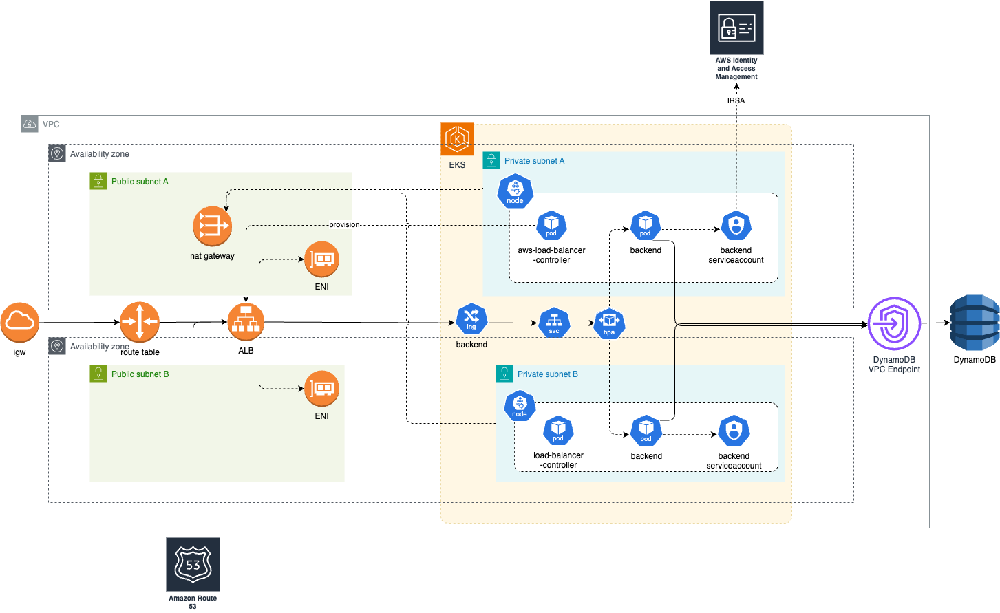

# backend-cloud-app

## Assumptions

### Environments, Accounts, and Workspaces

This project was developed assuming your local environment has your `~/.aws/credentials` and `~/.aws/config` properly setup.
For simplicity, I have used a local `[default]` account with an access key id and secret access key as part of my environment. This ensured that the resources were deployed on this account.

Additionally, this project assumes the existence of three separate AWS accounts, each dedicated to one of the SDLC environments:

- `dev`
- `staging`
- `prod`

Terraform namespaces correspond to these environment names, ensuring that the Terraform state for each cluster and its associated resources remains isolated.

For local development, Minikube is used with components being nested under the `dev` namespace.

### Pre-existing resources

Both GitHub OIDC and IAM role for GitHub Actions were added manually beforehand. More details [here](./docs/github_role.md).

### Testing of the backend code and infrastructure

I made the assumption that local testing primarily means testing how the backend code interacts with a DynamoDB endpoint. Essentially, this tests the functional aspect of the code. For this, Minikube was used.

However, certain aspects of the infrastructure were not tested locally — for example, the AWS ALB Ingress Controller or the horizontal pod autoscaler — as these were not compatible with Minikube.

I wanted to prioritize AWS environments for infrastructure testing and, for this reason, did not delve further into testing infrastructure through Minikube.

### Data Layer

Given that the data in this challenge does not represent relational structures, DynamoDB was chosen as the primary data store. This choice facilitates faster iteration on infrastructure Terraform files and simplifies management, scaling, and cost considerations.

To support local testing, a Kubernetes template is included to deploy `aws/dynamodb-local`, an AWS-provided DynamoDB local instance.

To ensure transactions remain within AWS premises, without the backend relying on the DynamoDB public API, I have deployed a VPC Endpoint for this purpose.

### NAT Gateway Configuration

Thinking of optimizing costs, only a single NAT gateway is deployed in one subnet. For production-grade high availability, deploying one NAT gateway per public subnet or availability zone is recommended.

### AWS Account Strategy and Separation of Concerns

While this repository supports configuration for different AWS Account IDs, testing was primarily conducted using a single AWS account.

For day-to-day purposes, I believe the contents of this repository should be split into separate repositories with different responsibilities. For the purpose of this challenge, this repository could be split into four repositories: one for core AWS infrastructure, another for EKS cluster contents such as Helm chart deployments, another for the backend application code and Helm chart of the backend itself, and lastly one related to DNS for HTTPS ingress on the infrastructure—which we can only provision after the core and Kubernetes are in place.

### Least privilege principle

At the expense of legibility and simplicity, the IAM role policies that I have provided are very specific with regard to which OIDC actor can assume the role. I could have kept things simpler by removing the condition checking altogether, but I thought it best to include it, since these would be essential for tightening security controls in a production environment.

## Requirements

This project was developed on Apple M1 Silicon hardware, which may require attention when setting up local development environments. For example, Terraform provider binaries for `arm64` are managed using `tfenv`.

The following tools are required:

- `python:3.12.4`
- Kubernetes utilities:
  - `kubectl`
  - `kubectx`
  - `kubens`
  - `k9s:0.50.4`
- `helm:v3.17.3`
- `minikube:v1.35.0` (for local testing)
- `docker`
  - Version: 25.0.3
  - API version: 1.44
- `tfenv`
- `terraform:1.11.4`

## Backend

located in the app folder

uses Flask and Gunicorn

### Tests

using pytest

Tested all cases provided in the challenge:

- test_missing_user
- test_get_valid_user
- test_get_valid_user_birthday_message
- test_get_valid_user_birthday_in_x_days
- test_invalid_username
- test_invalid_date
- test_put_valid_user
- test_health

Admittedly, the names of the tests could be improved to follow a more TDD convention, such as `givenValidUserName_whenPut_returnHttp204AndNoMessage`.

### Healthchecks

I have included a very simple `/health` endpoint, so that the chart can leverage this endpoint for readiness and liveness probes.

### Prometheus Metrics

I have included a `/metrics` endpoint for publishing backend metrics in Prometheus format. These include standard metrics which tend to be relevant from an SRE perspective, such as the total number of requests and total number of errored requests, among others.

### Instructions for Local Development and Testing

To streamline local development and facilitate CI/CD, several Makefile scripts are provided. The top-level `Makefile` aggregates and automates nested targets.

Follow these steps to deploy the backend and DynamoDB locally using Minikube:

```sh
make minikube-up
kubectx minikube
kubectl create namespace dev
kubens dev
make build-local deploy-backend-local
```

`deploy-backend-local` will automatically fetch the connection URL with the NodePort of the backend service using `minikube service backend -n dev --url`. At this stage, all you need to do is open a new terminal and start testing with `curl`.

Use this URL to test the backend with `curl` commands such as:

```sh
curl -X PUT http://127.0.0.1:<yourport>/hello/alice \
     -H "Content-Type: application/json" \
     -d '{"dateOfBirth": "1990-01-01"}'
```

```sh
curl http://127.0.0.1:<yourport>/hello/alice
```

To tear down the local environment, run:

```sh
make minikube-down
```

This will terminate Minikube and any open tunnel into the cluster.

### Future Improvements for the Backend

- Implement mocking of DynamoDB errors to improve test coverage (currently skipped for time constraints).
- Better naming for the provided tests as suggested above.
- Add a linter to the Makefile targets to enforce code quality.
- Reduce backend verbosity in Gunicorn config for logs to optimize ELK/OpenSearch stack usage. Debug logs are not needed in every environment.

## Helm chart

Located under the `helm` folder.

I have included a lightweight Kubernetes template for deploying `dynamodb-local` for testing purposes.

A `values.local.yaml` file is provided so that we can leverage `dynamodb-local` to emulate the interaction of the backend code against an actual DynamoDB endpoint, but locally for faster iteration. These values will be used when deploying locally with Helm onto the Minikube cluster, ensuring that the deployed backend points to the `dynamodb-local` endpoint for testing.

Similarly, there is a `values.yaml` used for remote deployment of the backend through the Helm provider in Terraform.

### Values.yaml

| Key | Type | Default | Description |
|:---|:-----|:---------|:------------|
| `replicaCount` | int | `1` | Number of replicas to deploy. |
| `image.repository` | string | `416761359656.dkr.ecr.eu-west-1.amazonaws.com/backend-cloud-app` | Image repository URL. |
| `image.name` | string | `backend-cloud-app` | Image name. |
| `image.tag` | string | `latest` | Image tag version. |
| `image.pullPolicy` | string | `Always` | Image pull policy. |
| `service.type` | string | `ClusterIP` | Kubernetes service type. |
| `ingress.enabled` | bool | `true` | Enable ingress. |
| `ingress.className` | string | `alb` | Ingress class name. |
| `ingress.host` | string | `""` | Host for ingress (empty by default). |
| `ingress.acmCertificateArn` | string | `""` | ACM Certificate ARN for SSL termination. |
| `ingress.annotations.alb.ingress.kubernetes.io/scheme` | string | `internet-facing` | ALB scheme (internet-facing). |
| `ingress.annotations.alb.ingress.kubernetes.io/target-type` | string | `ip` | ALB target type. |
| `ingress.annotations.alb.ingress.kubernetes.io/listen-ports` | string | `'[{"HTTP":80,"HTTPS":443}]'` | ALB listener ports. |
| `ingress.annotations.alb.ingress.kubernetes.io/actions.ssl-redirect` | string | JSON redirect config | Redirect HTTP to HTTPS. |
| `ingress.annotations.alb.ingress.kubernetes.io/ssl-redirect` | string | `"443"` | SSL redirect port. |
| `environment` | string | `""` | Deployment environment name. |
| `dynamodb.endpoint` | string | `https://dynamodb.eu-west-1.amazonaws.com` | DynamoDB service endpoint. |
| `dynamodb.table` | string | `users` | DynamoDB table name. |
| `aws.accountId` | string | `416761359656` | AWS account ID. |
| `aws.irsa.enabled` | bool | `true` | Enable IRSA for IAM roles for service accounts. |
| `aws.irsa.roleName` | string | `dev-backend-irsa-role` | IRSA role name. |
| `hpa.enabled` | bool | `true` | Enable Horizontal Pod Autoscaler. |
| `hpa.minReplicas` | int | `2` | Minimum number of pod replicas. |
| `hpa.maxReplicas` | int | `10` | Maximum number of pod replicas. |
| `hpa.targetCPUUtilizationPercentage` | int | `70` | Target CPU utilization for autoscaling. |

### Values.local.yaml

To avoid repetition, I won't duplicate the markdown table. Instead, here are the differences between the two files:

| Field | `values.yaml` | `values.local.yaml` | Difference |
|:------|:--------------|:--------------------|:-----------|
| `ingress.host` | `""` | `"backend.local"` | No hostname set in default, local hostname configured in local. |
| `aws.accountId` | `416761359656` | `123456789` | Real AWS account ID vs fake/test ID. |
| `image.repository` | `416761359656.dkr.ecr.eu-west-1.amazonaws.com/backend-cloud-app` | `backend-cloud-app` | Repository is public ECR in default vs simple local image name in local. |
| `dynamodb.region` | *(not set)* | `eu-west-1` | Region is set explicitly in local only. |
| `aws.irsa.roleName` | `dev-backend-irsa-role` | `fake-role` | Real IRSA role name vs fake role for local dev. |
| `aws.irsa.enabled` | `true` | `false` | IRSA (IAM roles for service accounts) enabled in default, disabled locally. |
| `dynamodb.endpoint` | `https://dynamodb.eu-west-1.amazonaws.com` | `http://dynamodb-local:8000` | Real AWS DynamoDB vs local DynamoDB emulator. |
| `image.pullPolicy` | `Always` | `IfNotPresent` | Always pull image in default, skip if already present in local. |
| `environment` | `""` | `local` | Environment explicitly set to `local`. |
| `ingress.className` | `alb` | `nginx` | ALB ingress controller in default, Nginx ingress controller in local. |
| `service.type` | `ClusterIP` | `NodePort` | Internal-only service in default, externally accessible via NodePort in local. |
| `ingress.annotations` | ALB annotations (`alb.ingress.kubernetes.io/...`) | Nginx annotation (`nginx.ingress.kubernetes.io/rewrite-target`) | Different ingress controller-specific annotations. |

## AWS Infrastructure

### Architecture Diagram



### HTTPS

The ingress of the backend service is configured to accept HTTPS traffic. The appropriate AWS Certificate Manager (ACM) certificate is created on the domain, which is then provisioned by Route53 and associated with the load balancer.

Therefore, testing the backend is as simple as using curl on HTTPS. If you want to use HTTP, it will be redirected to HTTPS, so make sure you configure curl to follow redirects.

### GitHub OIDC and GitHub Actions IAM Role

A GitHub OIDC provider was created manually, as there can be only one with the required token.

First, the trusted entities:

```json
{
    "Version": "2012-10-17",
    "Statement": [
        {
            "Effect": "Allow",
            "Principal": {
                "Federated": "arn:aws:iam::416761359656:oidc-provider/token.actions.githubusercontent.com"
            },
            "Action": "sts:AssumeRoleWithWebIdentity",
            "Condition": {
                "StringEquals": {
                    "token.actions.githubusercontent.com:aud": "sts.amazonaws.com"
                },
                "StringLike": {
                    "token.actions.githubusercontent.com:sub": "repo:joaopccosta/backend-cloud-app:*"
                }
            }
        }
    ]
}
```

The `github_actions` IAM role was also created manually so GitHub Actions can assume the role and perform actions on AWS. For the sake of brevity of this readme file, please refer to [the provided documentation](./docs/github_role.md) on the particular policies that were attached.

### AWS Folder

Core AWS resources provisioned here, such as:

- VPC, route table, subnets
- Security groups
- IAM roles, policy attachments, IAM Roles for Service Accounts (IRSA)
- DynamoDB table
- ACM certificate and validation
- The EKS cluster itself

### Kubernetes Folder

Created for Kubernetes-specific resources like:

- Namespaces
- Helm deployments
  - AWS Load Balancer Controller
  - Backend itself
  - `kube-state-metrics` for kubernetes related metrics
  - `otel-collector` for scraping the `/metrics` from both backend and `kube-state-metrics`
- Service accounts


### DNS Folder

- Creates Route53 record
- Depends on the load balancer's private hosted zone ID
- There were race conditions because the load balancer may not be placed yet, so it has no zone ID yet, and Terraform would fail.

### Instructions for Remote Deployment and Testing

All you should need to run are the commands below to deploy a `dev` cluster on the account in your environment:

```sh
make init-aws plan-aws apply-aws
make init-kubernetes plan-kubernetes apply-kubernetes
make init-dns plan-dns apply-dns
```

**Note:** After creating the EKS cluster, the Makefile automatically updates your local `.kube/config` to point to the new cluster.

If you want to create a separate environment, just pass an `ENV` variable like so:

```sh
make init-aws plan-aws apply-aws ENV=staging
make init-kubernetes plan-kubernetes apply-kubernetes ENV=staging
make init-dns plan-dns apply-dns ENV=staging
```

These are the variables exposed from the top-level makefile that can make it easier for you to publish the infrastructure.
```sh
ENV ?= dev
IMAGE_NAME ?= backend-cloud-app
VERSION ?=1.0.0
AWS_USERNAME ?= some-username
ECR_REGISTRY ?= 416761359656.dkr.ecr.eu-west-1.amazonaws.com
VERSION ?= 1.0.0
```

I have managed to deploy all three environments into the same aws account, because resources are kept separate. In any case, I would still advocate for having separate AWS accounts for each environment.

### Future Improvements for Infrastructure

#### Autoscaling

- Implement true scaling:
  - I deployed a Horizontal Pod Autoscaler (HPA) but the cluster is not configured to grow its node groups.
  - Use Cluster Autoscaler so the cluster size can grow in terms of nodes in node groups.
  - Both combined will solve the issue where binpack can't place replicas in the existing nodes
- Something related is the fact that I did not set `requests` limits - for cpu nor memory.
  - I would look into making sure these are defined so that the pods don't consume resources indefinitely. 

#### Security

- Put a CDN in front of the public load balancer so that we can cache the responses.
  - We can also improve security by attaching a special header
  - The same header will be inspected by the public load balancer
  - If the header is missing (someone is contacting the public load balancer directly), discard the request
  - This saves costs on WAF
- Deploy WAF in front of the CDN
  - Allows the implementation of rate limiting rules
- Enable AWS Shield for some level of automated security, e.g., against DDoS
- Deploy a dedicated production cluster in a separate AWS account to improve isolation, governance, and cost control
- If the need for secrets arises, use Secrets Manager
  - Use a dedicated AWS account for secrets management (e.g., Vault), delegating access via Secrets Manager and KMS

#### Observability

- I did not do anything with `kube-state-metrics` nor `otel-collector`. I simply installed the charts.
- The next step would be to export custom metrics to cloudwatch so they can back the Horizontal Pod Autoscaler. This way you cease to scale based on sheer infrastructure metrics (cpu/memory utilization), and can start scaling based on business metrics of interest.
- Standard metrics could be exported with a standard `otel-collector` exporter to interface with the most used metrics ingestion system.
- In turn this would allow one to define more meaningful Service Level Indicators, Service Level Objectives, and finally Service Level Agreements.

#### Repository Structure

- Separate the existing Terraform folders into separate repositories: one for core infrastructure components such as VPC configuration, IAM management, EKS, DNS, Kubernetes, etc.
- Add a linter for Terraform code.

## CI/CD

### Workflows

- Sensitive values have been stored in the GitHub Actions Secrets.
- There are the following workflows:
  - `ci-cd.yaml` – test Python, build Docker image, publish to ECR with version tag (no semver)
  - `aws.yaml` – Manual trigger: init and plan of `terraform/aws`.
  - `kubernetes.yaml` – Manual trigger: init and plan of `terraform/kubernetes`.
  - `dns.yaml` – Manual trigger: init and plan of `terraform/dns`.
  - `aws-apply.yaml` – Manual trigger: init, plan, **and apply** plan of `terraform/aws`.
  - `kubernetes-apply.yaml` – Manual trigger:  init, plan, **and apply** plan of `terraform/kubernetes`.
  - `dns.yaml-apply` – Manual trigger:  init, plan, **and apply** plan of `terraform/dns`.

#### Terraform apply - Why I could not make it a manual step

I could not get the workflows to work as I intended — most of my experience comes from other systems like GitLab, Jenkins, or CircleCI. I could not get any particular step to run manually. The alternative to achieve this seems to be to have a GitHub Enterprise account so you can create environments, which I could not create. The other alternative would be to make several workflows only for applying terraform. I adopted this approach.

I tried storing the terraform plan.out artifacts to keep the code leaner, but had no success due to shortcomings on pulling artifacts from other workflows. I did try getting github personal access tokens onto the job themselves to try to achieve this, like in the [original documentation](https://github.com/actions/download-artifact?tab=readme-ov-file#download-artifacts-from-other-workflow-runs-or-repositories) but had no success.

**This is the single reason why I have terraform apply automated, otherwise I would never get it automated as it can have serious consequences.**

I wanted this design choice to be deliberate as to avoid accidental apply of infrastructure. Furthermore, it is necessary to have the terrafom apply steps as manual, seeing that there are dependencies between terraformed resources across aws<-kubernetes<-dns - e.g. `helm.tf` from `terraform/kubernetes` needs `eks.tf` resources from `terraform/aws` to exist in the first place.

My intended workflow was as follows:

Test → Build and push image → init AWS → plan AWS → (Manual trigger) apply AWS → init Kubernetes → plan Kubernetes → (Manual trigger) apply Kubernetes → init DNS → plan DNS → (Manual trigger) apply DNS.

With this approach, we could then use an environment variable to define which resources would be terraformed as: dev, staging, or prod. It would then stop at the manual steps so that applying infrastructure has both a consistent order and a deliberate intention.

## Future Improvements for CI/CD

- Integrate Atlantis for Terraform automation through CI/CD. This should work around the shortcoming of the manual workflows that I have encountered.
- Implement proper semantic versioning to propagate through Docker image and Helm chart versions.
- Use ChartMuseum or similar tools to publish Helm charts as artifacts, enabling semantic versioning.
- Automate cleanup of untagged ECR images to manage storage costs.
- Refactor actions so that common blocks are re-usable.
  
## Miscellaneous

If you end up provisioning infrastructure in an AWS account, and while trying to clean up after yourself and destroying resources, you get stuck destroying a Kubernetes namespace, get rid of the finalizers with:

```sh
kubectl get namespace dev -o json | jq 'del(.spec.finalizers)' | kubectl replace --raw "/api/v1/namespaces/dev/finalize" -f -
```
